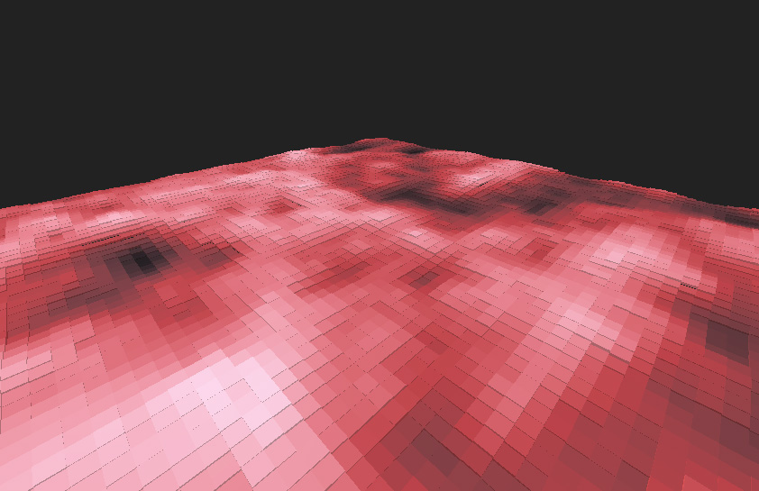

# Perlin noise with WASM and Three.js

This project was created in order to learn how to set up a quick workflow for WebAssembly (through Webpack).

If somebody could help out with generating the matrix purely in WASM, please send me a pull request! (See generateAndDrawMatrix in app.js).

